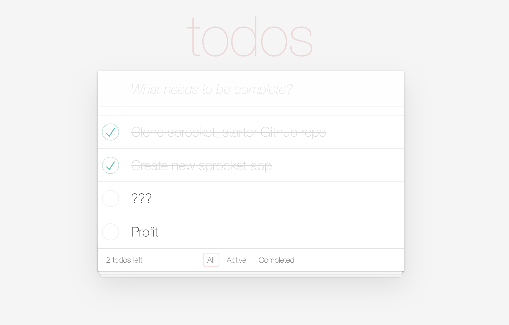

# Sprocket Todo MVC
Example codebase for a Todo MVC application using Sprocket.

For starting a new project, check out the [Sprocket Starter](https://github.com/bitbldr/sprocket_starter) project.

Based on:
- https://github.com/bitbldr/sprocket_starter
- https://github.com/gleam-lang/example-todomvc

## Installation

To install this project, make sure you have [Gleam](https://gleam.run) and [Yarn](https://classic.yarnpkg.com/lang/en/docs/install) installed, then follow these steps:

1. Clone the repository from GitHub.
2. Install the required gleam dependencies using `gleam deps download`.
3. Install the required client dependencies using `npm install` or `yarn`.
4. Start the project using `yarn watch`.

## Usage

Once you have installed and started the project, you can use it to explore Sprocket

## Contributing

We welcome contributions from the community. If you find an error in the docs or would like to contribute, please follow these guidelines:

1. Fork the repository.
2. Create a new branch for your changes.
3. Make your changes and commit them.
4. Push your changes to your fork.
5. Submit a pull request.

## License

This project is licensed under the MIT license. See the LICENSE file for more information.